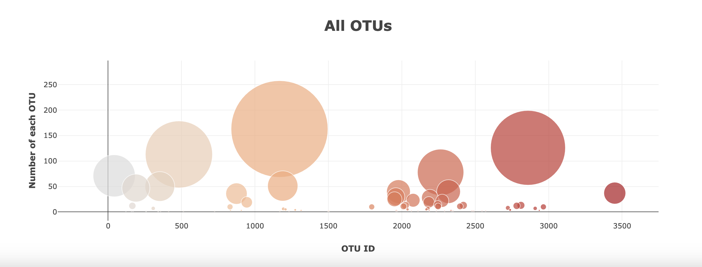

# d3-plotly-challenge
This project pulls in JSON data and uses D3 and Plotly to create interactive charts that update dynamically to display the selected sample.

To view this project in action, visit https://siobyrne.github.io/d3-plotly-challenge/ 

## Code Notes
* You can view the data by accessing the samples.json file in the main folder in the repo.

* The JavaScript code driving the app can be found in static/js.

## Examples of Charts

_Bar chart of Sample 940_

_Bubble chart of Sample 940_
